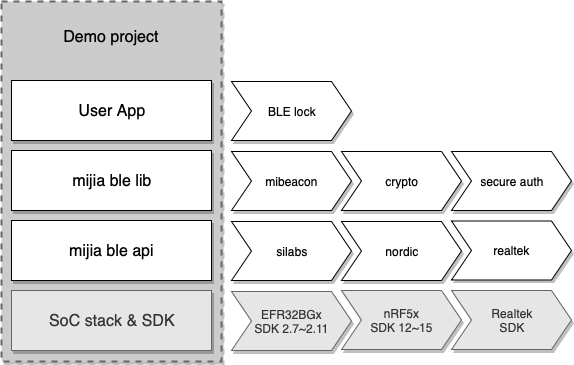

# 米家高安全级 BLE 产品接入指南
<!> 本文用于指导 **固件开发者** 实现高安全级 BLE 产品接入

## 0.准备工作
### 软件环境：
* IDE/toolchains (根据芯片 SDK 要求进行安装，如遇问题可咨询芯片原厂 FAE)
* [JLink](https://www.segger.com/downloads/jlink/)
* [Git](https://git-scm.com/downloads)

### 硬件环境：
硬件平台可以选用芯片原厂的开发板，或使用在研产品 PCBA。推荐使用原厂开发板环境进行功能验证。完成功能验证后再移植到在研产品 PCBA。米家提供基于开发板实现的高安全级接入 Demo Project。<br>
Demo Project GitHub 地址如下：（请按照各分支下 README ，完成工程导入）

| 芯片厂商      | 芯片平台         | Demo Project                                                       |
| :----------- | :-------       | :----------------------------------------------------------------- |
| Nordic       | 51 Series      | https://github.com/MiEcosystem/mijia_ble_secure/tree/nordic_legacy |
| Nordic       | 52 Series      | https://github.com/MiEcosystem/mijia_ble_secure/tree/nordic        |
| Silicon Labs | BG13           | https://github.com/MiEcosystem/mijia_ble_secure/tree/silabs        |

安全认证需要外接认证芯片。有关米家认证芯片的详细资料以及样片申请 (liuyamei@xiaomi.com)。

## 1.代码集成
(*如果开发者在 Demo Project 基础上进行开发，可以跳过本节 1~5 步*)

Demo Project 代码结构：



如上图所示，高安全级 BLE 产品接入需要用到以下代码：
* SoC SDK & 协议栈
* [mijia ble api](https://github.com/MiEcosystem/mijia_ble_api)
* [mijia ble libs](https://github.com/MiEcosystem/mijia_ble_libs.git)

其中，SoC stack & SDK 由芯片原厂提供，米家会推荐已验证的 SDK 版本；
mijia ble api & libs 由米家提供，以源码形式托管在 GitHub 上。开发者可以通过 git submodule 方式将米家代码集成到自己仓库中。以便后续通过 submodule update 方式升级 api & libs。mijia ble api 为开源仓库，无需申请权限即可访问。mijia ble libs 为私有仓库，需申请访问权限。（请联系产品接口人）

### 集成方法如下：
（将以 nordic 为例，示例如何具体操作）

1.下载芯片原厂 SDK。(SDK 版本根据 mijia ble api 要求进行选择)
```
示例：从 nordic 官网下载 [SDK 15.2.0](https://www.nordicsemi.com/Software-and-Tools/Software/nRF5-SDK/Download#infotabs)
```

2.按照芯片原厂 SDK 说明文档，新建 BLE 空工程。(如果已创建工程，可以跳过此步)
```
示例：nordic BLE 空工程在 `SDK\examples\ble_peripheral\ble_app_template` 目录下，复制一份 ble_app_template 并重命名，比如叫 secure_demo
```

3.在新建的 BLE 工程目录下创建 [Git](https://git-scm.com/) 本地仓库。(如果已有本地仓库，可以跳过此步)
```
示例：
$ git init
```

4.添加 mijia ble api 和 mijia ble libs 到本地仓库。添加 mijia ble api 时需选择对应芯片平台的分支。
```
示例：
$ git submodule add -b nordic https://github.com/MiEcosystem/mijia_ble_api.git
$ git submodule add -b master https://github.com/MiEcosystem/mijia_ble_libs.git
$ git commit -am "add submodules mijia ble api & libs"
```

5.添加 mijia ble api 和 mijia ble libs 路径下源码到 BLE 工程中，并将路径加入工程的 `include path`。mijia ble api 会使用到 SoC SDK 中的 BLE，TIMER，IIC，FLASH 等功能，需要开发者将这些功能模块添加到工程中。 （详细资源占用情况及配置方法，请参考芯片对应分支下的 README）。添加下列路径下代码。
```
mijia_ble_libs
├── common
├── cryptography
│   └── mja1
├── mijia_profiles
├── secure_auth
└── third_party
    ├── SEGGER_RTT
    ├── mbedtls
    ├── micro-ecc
    └── pt
```

>[注意] libs 引用的 `./third_party/` 路径下的第三方开源代码（例如， mbedtls，RTT），可能在 SoC SDK 中已经包含。当工程编译出现重复定义时，开发者需要去掉 libs 中重复文件以解决冲突。（比如，原厂工程中已经包含 SEGGER RTT 文件，就无需再添加 `./third_party/SEGGER_RTT` 路径下源码）

6.创建一个配置文件，在文件中添加下列宏定义，然后将 `CUSTOMIZED_MI_CONFIG_FILE=<your_config.h>` 添加到工程 `Preprocesser symbols`中；或者直接将以下宏定义添加到工程的 `Preprocesser symbols` 配置中；

| 宏名                      | 作用                                         |
| :------------------------ | :------------------------------------------- |
| CUSTOMIZED_MI_CONFIG_FILE | 自定义的 config 头文件                         |
| HAVE_MSC                  | 外接认证芯片型号 1，MJSC系列；2，MJA1系列        |
| MI_BLE_ENABLED            | 支持米家安全认证                               |
| MI_LOG_ENABLED            | 打开调试log，仅在调试阶段使用，量产时应去除        |
| MI_ASSERT                 | MI_LOG_ENABLED 打开时才有效，进行 assert 检查   |
| PRODUCT_ID                | 必须与在小米IoT开发者平台创建的产品 ID 相同       |
| DEVELOPER_VERSION         | 开发者固件版本号                               |

*<注1> MJSC为第一代米家认证芯片，已停产。MJA1为第二代米家认证芯片。* <br>
*<注2> 如果缺省宏定义，会采用 mi_config.h 中默认值。例如，不定义 PRODUCT_ID，则默认为 0x01CF 小米蓝牙安全开发板，此产品为白名单用户可见。（如需使用此 PID 进行功能验证，请申请白名单权限）*

## 2.米家认证
(*进行以下步骤前请**先阅读** mijia ble libs [**使用手册**](https://github.com/MiEcosystem/mijia_ble_libs/blob/master/readme.md)*)

高安全级 BLE 接入设备需支持 **米家安全认证协议** `secure auth`，该功能已在 `mijia ble libs` 中集成，使用方法如下：

1.芯片运行环境初始化（包括但不限于芯片电源，时钟，GPIO，TIMER，IIC，BLE stack）。

2.使用 `mibeacon_data_set()` 生成 [**mibeacon**](https://github.com/MiEcosystem/miio_open/blob/master/ble/02-米家BLE%20MiBeacon协议.md) 广播数据，并开始广播。
[示例代码](https://github.com/MiEcosystem/mijia_ble_secure/blob/c8fdaf4daedc412c7af1fdfa39fbd59e9874d27e/main.c#L521-L561)

3.实现 C 标准库 `time` 相关函数，初始化系统时间 。`time()` 参考实现
[示例代码](https://github.com/MiEcosystem/mijia_ble_secure/blob/c8fdaf4daedc412c7af1fdfa39fbd59e9874d27e/time.c#L22-L40)

4.调用 `mi_service()` 创建米家服务。米家服务提供认证数据传输通道，服务缺失将导致 App 认证失败。

5.根据米家认证芯片硬件连线，定义 IIC 引脚配置 `iic_config`，实现电源管理函数 `mijia_secure_chip_power_manage()`，以及认证事件处理函数 `mi_schd_event_handler()`，进行 `mi_scheduler_init()` 初始化。（`mi_schd_event_handler()` 在收到 SCHD_EVT_OOB_REQUEST 事件的 30 秒内，产品端要根据自身 IO 能力获取 OOB，再调用 `mi_input_oob()` 向 `mi_schduler` 提供所需 OOB。）初始化后，调用 `mi_scheduler_start(SYS_KEY_RESTORE)` 尝试读取绑定信息，执行结果会通过 `mi_schd_event_handler()` 传参返回。如果已重置，将收到 SCHD_EVT_KEY_NOT_FOUND 事件。
[示例代码](https://github.com/MiEcosystem/mijia_ble_secure/blob/c8fdaf4daedc412c7af1fdfa39fbd59e9874d27e/main.c#L823-L830)

6.将 `mi_schd_process()` 添加到 main loop 中。

7.米家认证相关的事件，会通过 `mi_schd_event_handler()` 通知应用层：

| 事件名称                          | 含义                                         |
| :------------------------------- | :------------------------------------------ |
| SCHD_EVT_REG_SUCCESS             | 绑定注册成功                                  |
| SCHD_EVT_REG_FAILED              | 绑定注册失败                                  |
| SCHD_EVT_ADMIN_LOGIN_SUCCESS     | 管理员登录成功                                |
| SCHD_EVT_ADMIN_LOGIN_FAILED      | 管理员登录失败                                |
| SCHD_EVT_SHARE_LOGIN_SUCCESS     | 分享者登录成功                                |
| SCHD_EVT_SHARE_LOGIN_FAILED      | 分享者登录失败                                |
| SCHD_EVT_TIMEOUT                 | 操作超时                                     |
| SCHD_EVT_KEY_NOT_FOUND           | 未绑定                                       |
| SCHD_EVT_KEY_FOUND               | 已绑定                                       |
| SCHD_EVT_KEY_DEL_SUCC            | 重置成功                                     |
| SCHD_EVT_OOB_REQUEST             | 请求输入 OOB                                 |
| SCHD_EVT_MSC_SELF_TEST_PASS      | 认证芯片自检正常                              |
| SCHD_EVT_MSC_SELF_TEST_FAIL      | 认证芯片自检异常                              |

此外，开发者可以使用 `mi_scheduler_start()` 发送以下命令，进行本地系统管理：

| 命令名称                     | 含义                                        |
| :-------------------------- | :----------------------------------------- |
| SYS_KEY_RESTORE             | 读取绑定信息                                 |
| SYS_KEY_DELETE              | 删除绑定信息                                 |
| SYS_MSC_SELF_TEST           | 认证芯片自检                                 |


经过以上步骤，产品侧已支持米家安全认证功能，可以使用米家 App 进行功能验证。window 平台具体操作如下：
* 打开 JLink RTT Viewer，选择对应芯片型号，连接待测产品。连接成功后，Terminal 0 下会显示产品侧 log 信息；
* 开启蓝牙，打开米家 App，点击右上角 ➕ 发现附近的设备；（如果没有出现待测产品，请检查 mibeacon 广播格式以及产品 PID 是否正确。）
* 点击待测产品，开始注册绑定。（产品侧 log 会提示连接状态等信息，当提示输入 OOB 数据时，输入 App 端显示的 6 位数字。）
* 注册绑定成功后，即进入产品插件页（如果 App 插件暂未上传，可以跳过此步骤。）
* 退出插件，再次进入，米家 App 将进行登录操作。
* 重置方法，目前需要两步
    - 米家 App 里删除设备
    - 设备上长按重置按钮

## 3.应用层开发
认证完成后，产品便具备安全通信的能力。在安全通信的基础上，可实现各种应用功能，比如，门锁应用，透传应用。

### 米家门锁服务
米家定义了一套门锁应用层规范 `lock profile`，使得米家 App 能对锁类产品进行统一的蓝牙操作。`lock profile` 只提供门锁通用操作、状态、事件上报功能，故不能满足产品的其他功能需求(比如，指纹管理)。如需支持其他功能，开发者可创建自定义服务，并采用安全通信方式读写自定义服务特征值。具体实现请参考 [米家透传服务](#米家透传服务)。

*<注> 门锁类产品必须具备米家门锁服务，米家 App 才可以进行开关锁操作和锁事件上报*

1.调用 `lock_service()` 创建米家门锁服务，注册锁操作回调函数 `ble_lock_ops_handler()`，门锁操作码会通过回调函数通知应用层。
[示例代码](https://github.com/MiEcosystem/mijia_ble_secure/blob/c8fdaf4daedc412c7af1fdfa39fbd59e9874d27e/main.c#L834-L836)

2.当 `ble_lock_ops_handler()` 收到锁操作码后，应立即执行对应操作 (比如，控制电机旋转开锁)，并使用 `mibeacon_obj_enque()` 向蓝牙网关广播锁事件，使用 `send_lock_log()` 向米家 App 回复锁事件。
[示例代码](https://github.com/MiEcosystem/mijia_ble_secure/blob/c8fdaf4daedc412c7af1fdfa39fbd59e9874d27e/main.c#L754-L789)

### 米家透传服务
米家透传服务作为一个示例，演示如何在一个自定义服务上实现加密传输。

1.参考 `stdio_service_init()` 创建数据传输示例服务，注册回调函数，以接收 App 数据。(示例服务创建时使用了 mijia ble api, 开发者可直接使用原厂 SDK API)
[示例代码](https://github.com/MiEcosystem/mijia_ble_libs/blob/3b733870ca186662761f153f850537bae022fb5d/mijia_profiles/stdio_service_server.c#L168-L234)

2.发送数据前，先使用 `mi_session_encrypt()` 加密数据，再发送。参考 `stdio_tx()` 实现；
[示例代码](https://github.com/MiEcosystem/mijia_ble_libs/blob/3b733870ca186662761f153f850537bae022fb5d/mijia_profiles/stdio_service_server.c#L237-L261)

3.接收加密数据后，调用 `get_mi_authorization()` 判断设备当前登录状态，若已登录使用 `mi_session_decrypt()` 解密数据，再上报应用层处理。参考 stdio 服务 `on_write_permit()` 实现：
[示例代码](https://github.com/MiEcosystem/mijia_ble_libs/blob/3b733870ca186662761f153f850537bae022fb5d/mijia_profiles/stdio_service_server.c#L76-L96)

## 4.FAQ

#### Q: 有问题怎么办？
A: 关于产品定义或[小米IoT开发者平台](https://iot.mi.com/)的问题，请联系米家产品经理。技术问题请区分是芯片开发的问题还是米家接入的问题。如果是芯片开发的问题，请联系厂商 FAE，如果是米家接入的问题，请先搜索[米家高安全级接入示例demo](https://github.com/MiEcosystem/mijia_ble_secure)相关 issue，看是否有类似的问题。如果没有，请按照模板创建新 issue。

#### Q: 如何查看 log 信息？
A:设备端：请下载并安装 JLink，
- unix-like platform：
```bash
添加 JLinkExe 到 $PATH，后执行 JLinkExe
$ JLinkExe -device <your_soc_platform> -if swd -speed 1000 -RTTTelnetPort 2000 -autoconnect 1
新开一个 term，然后 telnet 本地 2000 端口：
$ telnet localhost 2000
```
- windows platform：打开 Segger JLink RTT Viewer，选择对应芯片型号。连接成功可直接查看log。
 
App端：
- android ：安装 [debug 版本 APK](https://github.com/MiEcosystem/NewXmPluginSDK/blob/master/%E7%B1%B3%E5%AE%B6%E8%B0%83%E8%AF%95APK%E4%B8%8B%E8%BD%BD%E5%9C%B0%E5%9D%80.md)，然后查找文件管理 -> 手机 -> Android -> data -> com.xiaomi.smarthome -> files -> log -> miio-bluetooth log

#### Q: 为什么改变 PRODUCT_ID 的值就认证失败了？
A: 每个安全芯片只能绑定唯一一个 PID 和 MAC，如需更改 PID 或 MAC 请更换安全芯片。

