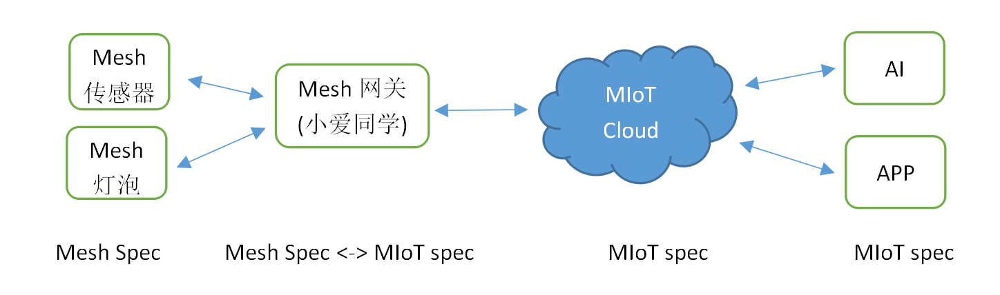
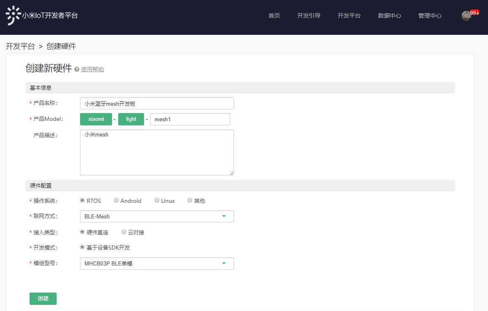
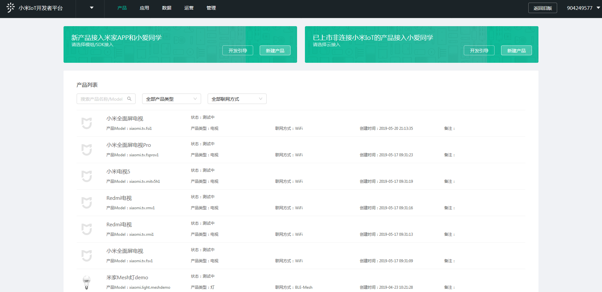
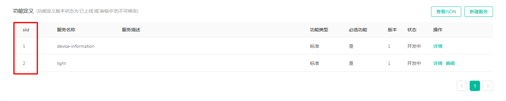
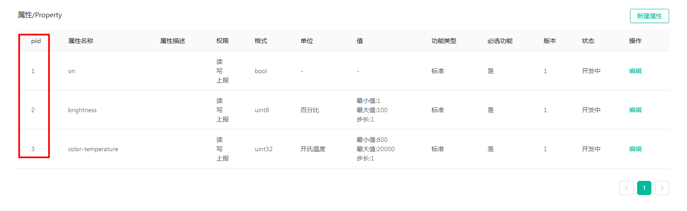

# 小米BLE Mesh开发者指南

*本文用于指导产品开发者利用已支持小米BLE Mesh接入的模组开发产品*

<br/>

## 背景知识

### 设备Profile

小米BLE Mesh系统会涉及到MIoT Spec和Mesh Spec两种Profile。

MIoT Spec是小米定义的产品应用层的功能规范，它对智能设备功能进行归类和统一，描述设备的功能和操作方法，并做了预定义。同样SIG也提供BLE Mesh的应用层规范，如Mesh Model、Status、Message等，本文称为Mesh Spec。

可以简单理解为，MIoT Spec是小米定义并实现的设备描述规范，Mesh网关、米家APP 、小爱同学，AI大脑、米家服务器均采用这套规范对设备进行控制；Mesh Spec是SIG定义的BLE Mesh应用层规范，用于BLE Mesh设备之间进行相互通信。两种规范会在Mesh网关完成转换，如下图：



### 模组 + 固件SDK

开发者拿到的模组和固件SDK已经实现了小米BLE Mesh的配网、配置、分组、IV更新等各种协议栈的功能，开发者只需要开发产品的应用功能即可。

设备重置：SDK并未强制规定设备的重置方法，但产品开发者必须自己定义设备的重置方法。例如对于照明设备，一般是快速开关5次重置设备，对于其他有按键的设备，可以通过长按5秒按键重置设备。

### 已支持芯片平台列表：

| 芯片品牌     | 芯片型号 | SDK                                                        | 资源                   |
| :----------- | :------- | :--------------------------------------------------------- | :--------------------- |
| Silicon Labs | BG13     | https://github.com/MiEcosystem/mijia_ble_mesh/tree/silabs  | Flash ~ 64K, RAM ~ 48K |
| Realtek      | RTL8762C | https://github.com/MiEcosystem/mijia_ble_mesh/tree/realtek | Flash ~ 80K, RAM ~ 48K |
| Telink       | TLSR8269 | https://github.com/MiEcosystem/mijia_ble_mesh/tree/telink  | Flash ~ 24K, RAM ~ 4K  |


## 产品创建流程

登陆[小米IoT开发者平台](https://iot.mi.com/new/index.html)，请先阅读“开发引导”熟悉接入流程。

### 创建BLE Mesh产品

如下图创建产品，创建后会生成Product ID（后文简称PID），PID需要写入到设备固件里面，因此需记录下来。**注意：联网方式一定要选择“BLE-Mesh”**，其他选项按照图片选择。模组型号根据使用情况而定，若无合适选项则选择“其它”并手动填写相应模组型号。



创建好产品后，从“数据中心”->“BI看板”选择对应的公司，点击进入产品管理界面。


在如下产品管理界面里选择相应的Model。



在“功能定义”中选择设备类型所需的模版。


为了简化操作，开发者平台提供了常见产品模板，如亮度灯、色温灯等。产品模板提供了常见产品的大部分功能需求，且模板的所有功能都对应了SIG Mesh Model，Mesh网关默认支持这些产品模板。

目前支持BLE Mesh模板名称及功能说明如下：后续会逐步增多更多的模板

|   名称    |        |           说明           |
| :-------: | :----: | :----------------------: |
| Lightness | 亮度灯 |    支持开关、亮度调节    |
| Lightctl  | 色温灯 | 支持开关、亮度、色温调节 |

强烈建议开发者直接使用模板，如果模板不能满足用户需求，用户在模板的基础上还可以添加自定义Service。当然用户也可以不选用模板，全部使用自定义Service。即使是用户自定义的Service，也建议用户选用MIoT Spec Service。因为小爱同学，AI大脑只能理解MIoT Spec的定义，这样定义后，功能可以被语音控制。

消息上行时，Mesh网关会将Mesh Spec消息翻译成MIoT Spec消息，消息下行时，Mesh网关会将MIoT Spec消息翻译成Mesh Spec消息。如果用户自定义了Service，网关不会翻译，会通过Vendor Model透传此Service的Service ID、Property ID、Value（MIoT Spec定义），设备固件在Vendor Model里面解析、处理。

### MIoT Spec Instance ID

生成设备实例以后需要获取实例ID，也就是Service ID（siid）和Property ID（piid）。如果开发者自定义了Service，则需要记下自定义功能的siid和piid值，在后面的固件开发中会用到（Mesh模板自带的siid和piid，开发者无需关心）。**注意：自定义属性的格式不能超过4字节。**





### 小米BLE Mesh模版

**本节内容涉及到Mesh Model与Miot Spec转换，只是用于加深固件开发者对二者的理解，可以略过本节内容不影响开发。**

小米BLE Mesh模板实现了MIoT Spec与Mesh Model的映射关系。

以色温灯为例，色温灯模板中包含两个Element，结构如下所示：

| Element | SIG Model ID |         Description          |
| :-----: | :----------: | :--------------------------: |
|    0    |    0x1000    |     Generic OnOff Server     |
|    0    |    0x1300    |    Light Lightness Server    |
|    0    |  0x038f0000  |       MIOT Spec Server       |
|    0    |  0x038f0002  |         Mijia Server         |
|    1    |    0x1306    | Light CTL Temperature Server |

相应的service和property描述如下：

| siid  | Service Description | piid  | Property Description | format  |      access       |  range/enum   |    unit    |
| :---: | :-----------------: | :---: | :------------------: | :-----: | :---------------: | :-----------: | :--------: |
|   1   | Device Information  |   1   |     Manufacturer     | string  |       read        |               |            |
|   1   | Device Information  |   2   |        Model         | string  |       read        |               |            |
|   1   | Device Information  |   3   |    Serial-Number     | string  |       read        |               |            |
|   1   | Device Information  |   4   |  Firmware Revision   | string  |       read        |               |            |
|   2   |        Light        |   1   |    Switch Status     |  bool   | read write notify |  true/false   |            |
|   2   |        Light        |   2   |      Brightness      | uint8_t | read write notify |   [0,100,1]   | percentage |
|   2   |        Light        |   3   |  Color Temperature   | kelvin  | read write notify | [800,20000,1] |   kelvin   |

Mesh Spec和MIoT Spec间映射关系如下：

| Mesh Element | Mesh Model | Mesh Opcode | siid  | piid  |  MIoT Spec Method  |
| :----------: | :--------: | :---------: | :---: | :---: | :----------------: |
|      0       |   0x1000   |   0x8201    |   2   |   1   |   get_properties   |
|      0       |   0x1000   |   0x8202    |   2   |   1   |   set_properties   |
|      0       |   0x1000   |   0x8204    |   2   |   1   | properties_changed |
|      0       |   0x1300   |   0x824B    |   2   |   2   |   get_properties   |
|      0       |   0x1300   |   0x824C    |   2   |   2   |   set_properties   |
|      0       |   0x1300   |   0x824E    |   2   |   2   | properties_changed |
|      1       |   0x1306   |   0x8261    |   2   |   3   |   get_properties   |
|      1       |   0x1306   |   0x8264    |   2   |   3   |   set_properties   |
|      1       |   0x1306   |   0x8266    |   2   |   3   | properties_changed |

上述翻译工作由Mesh网关完成，设备端仅需关心Mesh Spec相关实现。

## 产品开发引导

### 开发之前

- 与小米产品经理讨论确定产品的功能，能否适用于现在的小米BLE Mesh接入技术。
- 联系小米（yangyufeng@xiaomi.com），申请Github mijia_ble_mesh私有工程的权限。
- 申请对应平台的模组。

### Realtek 模组开发指导

此工程实现了一个BLE Mesh色温灯的基本功能。请首先阅读Readme。对此工程有疑问可以直接提交issue。

下载代码：运行`git clone --recursive https://github.com/MiEcosystem/mijia_ble_mesh -b realtek`

阅读文件夹下的《Development Guidance.pdf》，内有详细内容。

### Silicon Labs 模组开发指导

此工程实现了一个BLE Mesh色温灯的基本功能。请首先阅读Readme。对此工程有疑问可以直接提交issue。

下载代码：运行`git clone --recursive https://github.com/MiEcosystem/mijia_ble_mesh -b silabs`

将此工程导入到Simiplicity Studio IDE。（File -> Import -> more import options -> General: Exist projects into workspace）

连接Segger Jlink RTT Viewer可以查看模组中log

**强烈推荐首先阅读Silicon Labs提供的BLE Mesh文档及示例程序。** 本工程可以看作是基于标准BLE Mesh工程的一个具体应用。

- 在project-name.isc文件填写设备信息并创建Element, Model。
- 初始化Model。
```
    /* SIG Model */
    mesh_lib_generic_server_register_handler(MESH_GENERIC_ON_OFF_SERVER_MODEL_ID,
                                            0,
                                            onoff_request,
                                            onoff_change);

    /* Vendor Model */
    gecko_cmd_mesh_vendor_model_init(PRIMARY_ELEM,
                                    XIAOMI_COMPANY_ID,
                                    VENDOR_SERVER_MODEL_MIOT_SPEC,
                                    1,
                                    sizeof(miot_spec_opcode_set),
                                    miot_spec_opcode_set);
```
- 把对应的Model进行配置。将新创建的Model绑定appkey。并打开新创建SIG Model的publish，Vendor Model没有此项配置。其他配置保持不变。注意这些配置只有在进行完小米Provision之后才能执行。请仔细阅读代码，不要修改其他配置，仿照已有的Model配置来配置新创建的Model。
```
    /* SIG Model and Vendor Model */
    gecko_cmd_mesh_test_bind_local_model_app(
        p_list->head[i].elem_idx,
        p_list->head[i].appkey_idx,
        p_list->head[i].vendor == 0 ? 0xFFFF : p_list->head[i].vendor,
        p_list->head[i].model)

    /* SIG Model Only */
    result = gecko_cmd_mesh_test_set_local_model_pub(PRIMARY_ELEM, 0, 0xFFFF, 0x1000, XIAOMI_GATEWAY_GROUP, DEFAULT_TTL, PUB_PERIOD(6, STEP_10SEC), 0, 0)->result;
    MI_ERR_CHECK(result);
```
- 实现每个SIG Model的回调函数。例如`onoff_reques`回调函数中根据`transition_ms`和`delay_ms`实现了对开关灯的硬件操作。根据`request_flags`决定是否要回复消息。按照特定的延时publish status。请仔细阅读代码，注意`mesh_lib_generic_server_response`和`mesh_lib_generic_server_publish`函数都是在timer的timeout回调中执行的。
```
    static void onoff_request(uint16_t model_id,
                                uint16_t element_index,
                                uint16_t client_addr,
                                uint16_t server_addr,
                                uint16_t appkey_index,
                                const struct mesh_generic_request *request,
                                uint32_t transition_ms,
                                uint16_t delay_ms,
                                uint8_t request_flags)
    {
        /* operation GPIO according to delay_ms and transition_ms */
        if (delay_ms > 0) {
            // TODO
        } else if (transition_ms > 0) {
            // TODO
        } else {
            // TODO
        }

        /* response status according to request_flags. use a timer to make mesh system stable, do not modify it */
        if (request_flags & MESH_REQUEST_FLAG_RESPONSE_REQUIRED) {
            gecko_cmd_hardware_set_soft_timer(TIMER_MS_2_TIMERTICK(rsp_delay), TIMER_ID_ONOFF_RSP, 1);

            /* call mesh_lib_generic_server_response when timeout */
            // TODO set parameters when timeout
        }

        /* Publish status to publish address. use a timer to make mesh system stable, do not modify it */
        gecko_cmd_hardware_set_soft_timer(TIMER_MS_2_TIMERTICK(pub_delay), TIMER_ID_ONOFF_PUB, 1);

        /* call mesh_lib_generic_server_publish when timeout */
        // TODO set parameters when timeout
    }
```
- 实现Vendor Model的回调函数，根据event的类型做合适的操作。
```
    static void process_mesh_vendor_model_recv_event(struct gecko_cmd_packet *evt)
    {
        struct gecko_msg_mesh_vendor_model_receive_evt_t event = evt->data.evt_mesh_vendor_model_receive;
        // TODO
    }
```
- 自定义重置方式，例如连续开关多次。
```
    if (GPIO_PinInGet(BSP_BUTTON0_PORT, BSP_BUTTON0_PIN) == 0 ||
        GPIO_PinInGet(BSP_BUTTON1_PORT, BSP_BUTTON1_PIN) == 0 ||
        mesh_stat.quick_reboot > QUICK_BOOT_TIMES) {
            // TODO
            initiate_factory_reset();
        }
```
- 如果需要实现Indication。
```
    // TODO
```
- 如果需要实现低功耗。
```
    // TODO
```

更多资料

* [UG103.14: BLE Fundamentals](https://www.silabs.com/documents/login/user-guides/ug103-14-fundamentals-ble.pdf)
* [UG136: Silicon Labs Bluetooth C
Application Developer's Guide](https://www.silabs.com/documents/login/user-guides/ug136-ble-c-soc-dev-guide.pdf)

* [QSG148: Getting Started with the Silicon
Labs Bluetooth Mesh Lighting
Demonstration](https://www.silabs.com/documents/login/quick-start-guides/qsg148-bluetooth-mesh-demo-quick-start-guide.pdf)
* [AN1098: Understanding the Silicon Labs
Bluetooth Mesh Lighting Demonstration](https://www.silabs.com/documents/login/application-notes/an1098-understanding-bluetooth-mesh-lighting-demo.pdf)

### 更多

目前只支持手机直连GATT OTA，固件必须经过验签。
