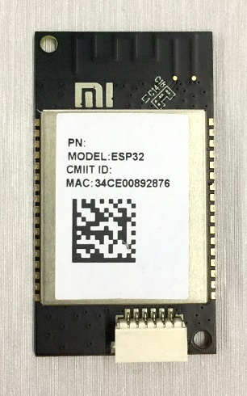
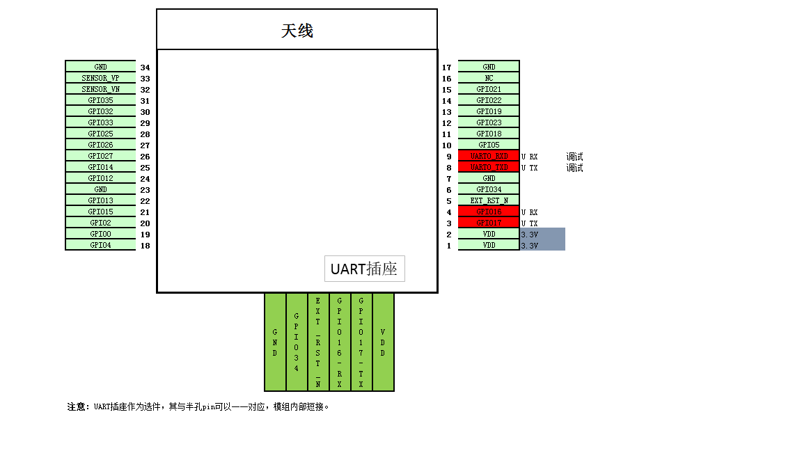
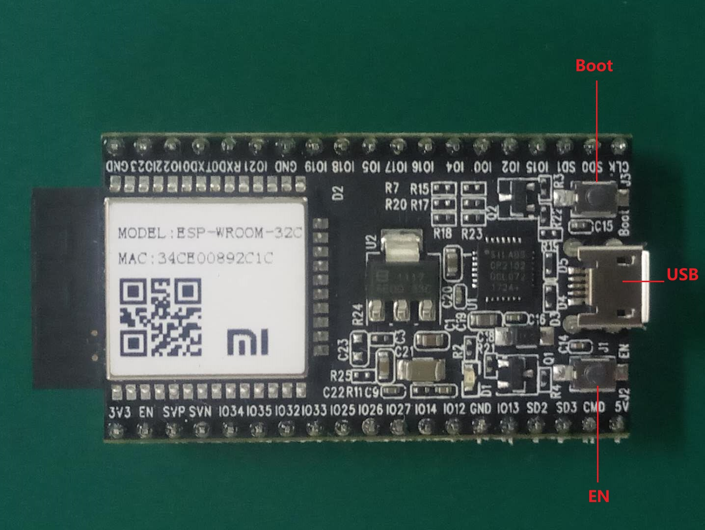
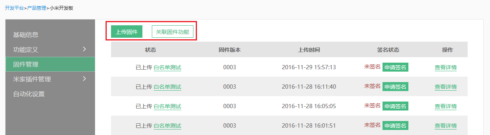
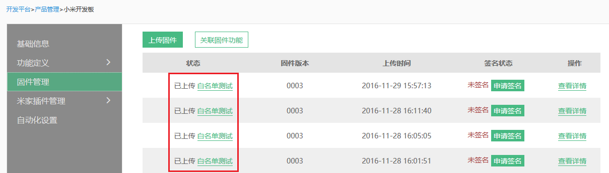

WIFI-BLE双模模组接入
====================
模组接入方式适合于不具备通讯能力的产品，需要将小米智能模组嵌入现有产品的电路中。将MIIO模组作为透传通道，通过串口和主控芯片进行业务逻辑交互。

目录
--------------
* [开发准备](#开发准备)
* [模组调试](#模组调试)
    * [双模模组硬件简介](#双模模组硬件简介)
    * [LOG输出测试](#log输出测试)
    * [串口通信测试](#串口通信测试)
    * [FAQ](#faq)
* [产品固件开发](#产品固件开发)
    * [模组工作原理](#模组工作原理)
    * [WIFI串口命令](#wifi串口命令)
    * [固件实现方法](#固件实现方法)
* [固件功能调试](#固件功能调试)
    * [开放平台调试](#开放平台调试)
* [产品固件管理](#产品固件管理)
    * [固件平台上传](#固件平台上传)
    * [固件OTA升级](#固件ota升级)
* [固件测试及上线](#固件测试及上线)


## 开发准备

**[小米IoT开放平台>开发引导](https://iot.mi.com/guide.html#/id=20/)中小米IoT开放平台接入相关介绍，请务必提前阅读。** 


## 模组调试

### 双模模组硬件简介

#### 小米MHCWB3P模组

外观图：



管脚图：



#### 小米MHCWB3P mini开发板外观

外观示意图：



- 小米MHCWB3P mini开发板基于乐鑫ESP32-DevKiC mini开发板定制，使用指南参照链接：http://esp-idf.readthedocs.io/en/latest/get-started/get-started-devkitc.html#overview
- 使用mini开发板Micro USB为LOG调试串口，通讯串口参照MHCWB3P引脚图引出，使用串口转USB工具通过PC进行模拟通讯。

#### 小米MHCWB2P模组带底板外观

外观图：


管脚图：


### LOG输出测试

- 模组LOG输出口  **115200 8N1** ，通过UART0的TX，RX作为LOG输出和指令输入口查看和调试LOG。
- 我们可以通过这个口看到模组工作状态。
- 模组上电后，可以看到一个典型的LOG输出，包含固件版本 *firmware*， 设备DID *digital_did*， MAC地址*mac address* 等。  


```
_|      _|  _|_|_|  _|_|_|    _|_|
_|_|  _|_|    _|      _|    _|    _|
_|  _|  _|    _|      _|    _|    _|
_|      _|    _|      _|    _|    _|
_|      _|  _|_|_|  _|_|_|    _|_|  

OTP read OK
JENKINS BUILD NUMBER: N/A
BUILD TIME: N/A
BUILT BY: N/A
firmware: 1.2.5
MIIO APP VER: N/A
MIIO MCU VER: N/A
ESP SDK VER: 1.3.0(2ecfb74)
digital_did is 12593364
mac address is f0b42905b742

```

### 串口通信测试

- 你只需要通过串口(**115200 8N1**)即可与小米模组进行通信，如图：


- 通过串口工具打开串口，输入help既可以得到支持的串口命令列表，此时证明串口工作正常。


### FAQ

- Q：模组无法启动，没有打印内容或者打印内容非常少，发现不了AP怎么回事？
- A：请检查连接线路是否OK，并确认GPIO0是否被拉低进入烧录模式或者GPIO15被拉高无法正常启动。如果还有问题，请咨询开发人员。
- Q：启动时在串口打印的乱码是怎们回事？  
- A：启动时打印的乱码为boot段代码，请确定串口设置波正确。串口转USB工具请不要使用PL2303，推荐使用CP2102,串口工具minicom中波特率可能无法更改，推荐使用SecureCRT。确定VCC接入电压稳定性。
- Q：通信串口输入help后无反应是怎么回事？
- A：可尝试输入“echo on”打开回显，如果返回“ok”则证明通信正常，可再次输入help获取命令列表。通过串口工具通信时，建议打开回显功能，方便查看。
```
>echo on
<ok
```


## 产品固件开发

### 模组工作原理

MIIO芯片提供一套可读的串口文本命令，供外部芯片调用，MIIO芯片只负责网络通讯，而不关心外部芯片业务逻辑。  
主控MCU与模组间使用文本指令通过串口进行交互，模组负责与服务器以Json形式通信，无需MCU关心。  


文本命令采用“一问一答”的方式，每条命令，无论执行成功与否，都会返回结果或错误提示。  
下文中，示例里的“↑”和“↓”分别代表命令和结果。有时，也称二者为“上行”信息和“下行”信息。因为在涉及到云通信的命令里，“上”代表发往云端，“下”代表从云端发来。

一个典型的上行例子（温度传感器上报温度）：

1. 传感器探知当前温度为26度
2. 传感器调用MIIO芯片的props命令，通过MIIO芯片向云端上报温度属性：props temp 26

一个典型的下行例子（手机app打开电源开关）：

1. 手机app发出打开开关指令
2. MIIO芯片接收到app的下行消息，并翻译为文本命令：set_power on
3. 主控MCU不停的使用get\_down命令轮询MIIO芯片，得到了set_power on命令
4. 主控MCU完成电源打开的操作
5. 主控MCU调用result ok，告知MIIO芯片成功完成
6. MIIO芯片回复ok，告知结果已收到

#### 关于[JSON RPC](http://json-rpc.org/wiki/specification)

当通过云端与设备通信进行调试时，指令将以JSON字符串的形式出现。相关调用规范和返回值请参考：[指令调用规范.pdf](http://orig.static.home.mi.com/docs/%E6%8C%87%E4%BB%A4%E8%B0%83%E7%94%A8%E8%A7%84%E8%8C%83.pdf)  

变量，函数的命令风格遵循[GNU-C](https://www.gnu.org/prep/standards/)风格，小写字母，下划线分隔就可以了。（拒绝驼峰式...）


### WIFI串口命令

**WIFI串口命令介绍见[串口命令](../md_images/new/MIIO模组串口指令详情.pdf)**  

**注意：模组串口命令均以\r为结尾。**

上行指令：get\_down，result，error，model，mcu_version，props，restore等。  
下行指令：MIIO\_mcu\_version\_req，MIIO\_model\_req，MIIO\_net\_change，update_fw。  
以上为模组工作必需指令，需要开发者在固件中进行实现。

**MCU上电后，需要先使用“model”，“mcu_version”设置model，固件版本号。**

### ble串口指令

#### ble_config

- 参数：set \<pid> \<mcu_version>    
&emsp;&emsp; &ensp;   dump  
- 示例：↑ble_config set 156 0001  
&emsp;&emsp; &ensp; ↓ok  
&emsp;&emsp; &ensp; ↑ble_config dump  
&emsp;&emsp; &ensp; ↓\["product id":190,"version":1.3.0_0000]  
- 即时返回：若参数为dump则返回模组当前PID及固件版本，否则返回ok/error  
- 说明：查看、设置模组ID及固件版本号。

**每次模组上电，均需要通过此命令进行配置。**

### 固件实现方法

正常工作情况下，设备MCU通过串口与模组进行通信，模组向云端发送或获取信息。 

完整接入实现需要MCU通过串口指令与模组进行通信，实现以下功能：

-  与模组进行交互获取某些信息（如），或控制模组完成某些动作。
-  模组接收云端下发的方法，通过串口发送至MCU，MCU完成相应动作。
-  MCU需要上报某些属性和方法时，通过相应串口指令发送给模组，模组将其上报至云端。
-  MCU通过串口接收到模组保留的下行指令时，做出相应响应。
  

MCU及模组正常工作模式为：

1. 主控MCU根据产品功能定义在内部实现串口通信相关逻辑。
2. 主控MCU向模组循环发送“get\_down”指令，以轮询模式，从模组处获取云端下发的指令。（推荐get_down指令循环周期为200ms）
2. 若模组回复“down none”，则暂无需要完成的命令，继续使用“get_down”命令轮询模组。
3. 若模组回复具体指令，则根据获取的下行指令，完成相应操作。
4. 指令执行后，调用“result”命令向模组发送命令执行结果。模组芯片回复“ok”表示结果已收到。
5. MCU对于模组的各项操作，均需使用相应串口指令，通过串口与模组通信。
6. 建议检测属性变化超过一定范围时，使用“props”指令上报当前属性值，不允许正常属性高频率上报。
7. 当有设定事件（Event）发生时，通过“event”指令上报事件。


## 固件功能调试

**注意：绑定设备所使用的小米账号需在该产品白名单内，否则无法发现设备。**

若您的APP端米家扩展程序已经完成主要功能，可以通过APP进行测试。  

若您的扩展程序未开发完成，或需要差异测试定位问题，同样可以在开放平台中进行云端调试。

### 开放平台调试

设备连入账号后，你可以在开发平台>功能调试中看到该设备。  
  
  
在1处选择测试功能，测试方法和对应指令，并可在2处修改指令。3处发送指令，并可点击“功能定义”进入功能编辑界面。  

通过测试功能及方法选择，可以逐条测试固件对于功能的实现情况。  

miIO.info是一个基本命令，你随时都可以向设备发送，查询设备的基本信息


## 产品固件管理

### 固件平台上传

产品固件完成后，需要在开发平台上进行上传，并**注意版本号必须符合平台规范，否则将影响后续固件升级功能**。  
  

#### 固件上传与CRC验证

MCU固件需要尾部添加CRC后再上传至平台，请务必使用我们提供的[工具](../md_images/crc32)自行添加（甚至可以集成到你的编译脚本里面）。  
  

上传时请认真填写固件信息，其中MCU版本号格式为**四位数字**。


#### 版本号上报

MCU上电后，设置产品的mcu_version。 

```
>mcu_version 1000
<ok
```

### 固件OTA升级

#### 升级流程说明

在MIIO芯片加主控MCU的串口方案中，MIIO芯片通过串口向MCU提供升级功能。升级功能由文本命令触发，并完成握手。数据传输使用了Xmodem协议，以数据全文校验通过表示成功结束，以超时退出表示失败。数据传输中文本命令暂停响应。为完成固件升级任务，MCU需实现如下功能：

1. MCU的应用固件必须能够识别升级命令，重启进入bootloader
2. bootloader必须能够完成握手过程
3. bootloader必须支持Xmodem数据接收，数据块大小为128B
4. bootloader必须支持Xmodem数据两种校验中的至少一种：校验和 或 CRC
5. MCU应用固件必须能够在适当时候通过mcu_version命令告知当前固件版本号，一般是一开始
6. 当MCU接收了不完整的数据（如中途断电），重启后bootloader应该能够发现，并停留在bootloader里的升级握手流程里
7. 为保证能够从错误中恢复，bootloader应该实现一个固定时长的握手窗口（详见下面）

| 步骤 | MIIO芯片 | 用户MCU |
|------|----------|---------|
|1|MIIO芯片接到来自网络的升级命令，开始下载用户MCU固件文件到缓冲区，下载完成并交验通过。|     |	 
|2|关闭除升级所需之外的所有文本命令。所剩可执行命令为：get\_down,result.对其他所有命令调用都返回error|  ↑get\_down<br>↓down update_fw <br>↑result "ready"  ↓ok|
|3|收到result "ready"后，进入Xmodem模式|收到ok后，进入Xmodem模式|
|4|Xmodem传输|Xmodem接收|
|5|传输完成，退出Xmodem模式，重新打开所有文本命令，擦除下载缓冲区里的固件|接收完成，校验通过，重启。|
|6|    |用mcu_version报告新版本号|

注意：
1. MIIO模组串口命令以“\r”作为结尾，例如“get_down\r”。
2. MCU通电存在延迟，建议MCU通电1s后发送“get_down”指令获取升级命令。
3. MIIO模组通过http连接下载固件，同MCU通过Xmodem协议进行数据传输。 
4. 传输数据包为128B，加上Header,Packet Number,CherckSum共计134字节。 
5. 传输最后一个包时，如果有效数据不足128B，则补齐为1A FF FF FF…若128B,则补加一个数据包，数据为1A FF FF
6. Xmodem传输数据握手时，第一个NAK或C用于确定校验方式，第二个NAK或C开始传输数据。因此超时时间不宜过长。 


#### 对特殊情况下控制设备不做升级的处理

1. 定义“ota_state”属性，在设备处于某些工作状态、电量不足或其他等暂时不能升级的状态时，MCU通过串口指令“props ota_state busy”上报属性至服务器，则此时设备不会检查到更新。设备转到可升级状态时，上报“ota_state idle”，则可正常检查更新。  
2. 若在MCU上报ota_state状态前，模组已收到ota指令，可按如下情况处理：正常升级流程中，模组收到服务器ota指令后会下载升级包，下载完成后通过串口向MCU下发update_fw指令，MCU回复“ready”，则正常进入升级流程。若MCU当前状态不可升级，可暂不进行回复，待状态可升级后再正常进入升级流程。


#### 对升级中意外断电的处理

如果升级握手不成功或者在Xmodem传输中意外断电，则MCU没有接收到完整地固件，需要重新传输。在上表中，MIIO下载的MCU固件会有相应的头部标识，通过头部标识可以区分固件种类（wifi固件、app固件或mcu固件），在传输成功后即擦除缓冲区中的头部标识。如果握手不成功或Xmodem传输中意外断电，MIIO没有擦除头部，在上电重启后检测缓冲区中的头部和crc，如果mcu固件的头部和crc校验通过则在MCU bootloader里预留的一个刚上电后的时间窗口里，和MCU握手，使其进入升级流程。为使该机制有效，做如下约定：

1. MIIO模块与MCU必须同时上电
2. MIIO模块和MCU上电后，完成最基本的初始化后（要求时间很短，100ms内），进入握手时间窗口，窗口持续1s
3. MIIO模块在窗口内首先校验下载缓冲区里的MCU固件，包括头信息、CRC，如果校验通过，则进入握手等待
4. MCU在窗口内，一直快速（间隔小于100ms）向MIIO模块发送get\_down，并检查是否有down update_fw

#### xmodem协议

你可以下载[xmodem源代码](../md_images/xmodem.c)，然后集成到你的主控MCU当中。  


#### 通过开放平台调试

编译好固件，添加CRC32，上传，获取固件的url后，你可以向设备发送如下命令来启动MCU OTA过程：

```
{"method":"miIO.ota","params": {"mcu_url":"xxxxxxx"}}
```


## 固件测试及上线

固件开发完成后，在开发平台中进行上传并关联此版本固件已实现的功能，你就可以开始进行测试了。  


白名单测试时，**只有该产品白名单成员能够进行测试**，请确定测试成员均在白名单范围中。  

测试完成后，申请上线，等待审核。


[返回目录](#目录)


